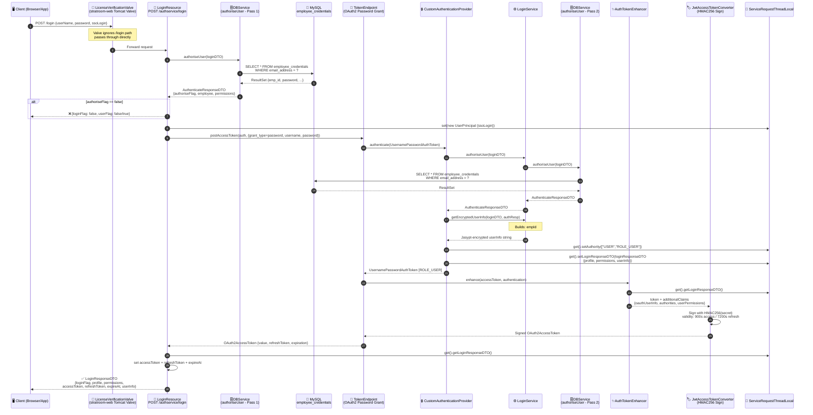
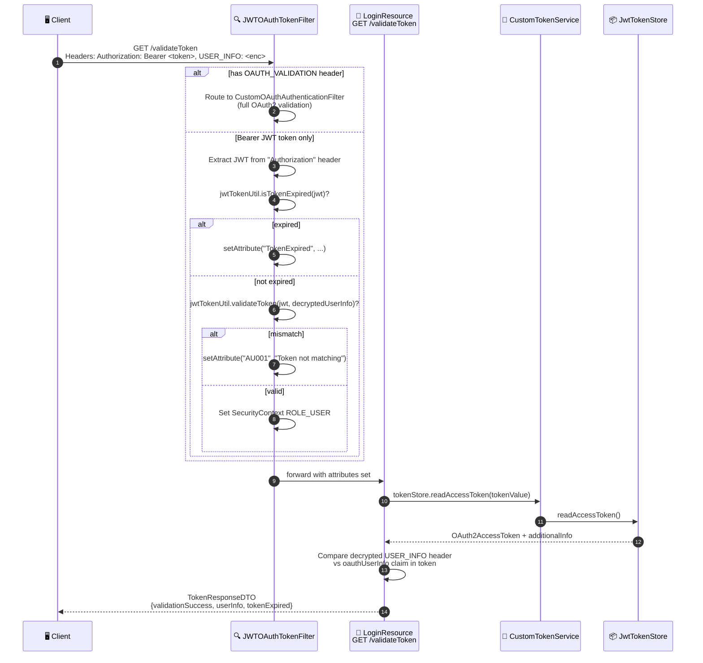
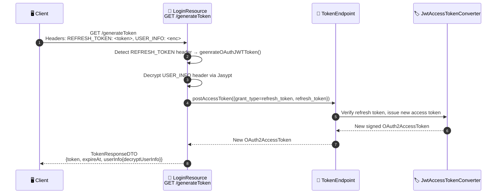
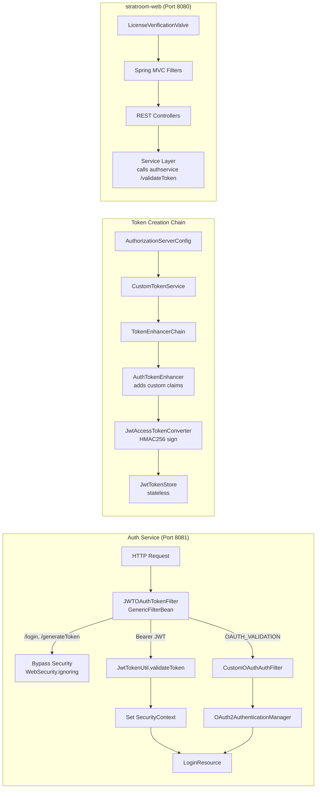

# 🏗️ Stratroom — Complete Architecture & Login Flow Analysis
> **Senior Java Developer Perspective (20 Years Experience)**  
> Stack: Spring Boot · Spring Security OAuth2 · JWT · MySQL · Microservices

---

## 📦 Project Structure Overview

Stratroom is a **multi-module Spring Boot microservices** application. Each module is an independently deployable Spring Boot service.

```
Stratroom-Source/
├── authservice/          ← 🔐 Authentication & Token Issuance (Port 8081)
├── db-service/           ← 🗄️  Database abstraction layer (Port 8083)
├── userservice/          ← 👤 User management
├── licenseservice/       ← 🪪 License validation
├── scorecard-service/    ← 📊 Scorecard/KPI domain
├── etl-service/          ← 📥 ETL / Data ingestion
└── stratroom-web/        ← 🌐 Main web application (WAR / Tomcat)
```

---

## 🧩 Microservice Roles

| Service | Port | Role |
|---|---|---|
| `authservice` | 8081 | Issues JWT & OAuth2 tokens, validates credentials |
| `db-service` | 8083 | Proxy to MySQL — handles employee/user queries |
| `userservice` | — | User CRUD & profile management |
| `licenseservice` | — | License key verification |
| `scorecard-service` | — | BSC Scorecard, KPIs, Org Charts |
| `etl-service` | — | ETL data pipeline |
| `stratroom-web` | 8080 | Frontend WAR, routes to all services via REST |

---

## 🔐 Auth Service — Deep Dive

### Key Classes

| Class | Package | Responsibility |
|---|---|---|
| `AuthServiceApplication` | `auth` | Spring Boot entry point — `@EnableAuthorizationServer` + `@EnableResourceServer` |
| `SecurityConfig` | `auth.config` | Spring Security config, JWT store, filter chain |
| `AuthorizationServerConfig` | `auth.config` | OAuth2 Authorization Server configuration |
| `LoginResource` | `auth.resource` | REST Controller — `/login`, `/validateToken`, `/generateToken` |
| `DBService` | `auth.service` | Directly queries MySQL `employee_credentials` table |
| `LoginService` | `auth.service` | Builds user info string + calls `DBService` |
| `OauthClientDetailsServiceImpl` | `auth.service` | Hardcoded OAuth2 client: `STRATROOM_CLINET_ID` |
| `CustomAuthenticationProvider` | `oauth` | Spring Security `AuthenticationProvider` — validates user |
| `CustomTokenService` | `oauth` | Extended `DefaultTokenServices` — manages token lifecycle |
| `AuthTokenEnhancer` | `oauth.component` | `TokenEnhancer` — embeds `oauthUserInfo` + permissions into JWT claims |
| `CustomClaimAccessTokenConverter` | `oauth.component` | Extracts custom claims back from JWT on validation |
| `JWTOAuthTokenFilter` | `auth.config` | `GenericFilterBean` — pre-filters every request for JWT/OAuth token |
| `JwtTokenUtil` | `jwt` | Auth0 JWT library wrapper — sign/verify/expire HMAC256 tokens |
| `EncryptionProvider` / `JasyptEncryptionProvider` | `encryption` | Jasypt-based symmetric encryption for user info header |
| `ServiceRequestThreadLocal` | `util` | `ThreadLocal<UserPrincipal>` — carries user context across a single request |
| `UserPrincipal` | `util` | Thread-scoped holder: SSO flag, authorities, `LoginResponseDTO` |
| `EmbeddedTomcatConfig` | `auth.config` | Reads JWT secret, Jasypt password, token expiry from `.properties` |

---

## 🔑 Login Flow — Step-by-Step Walkthrough

### Phase 1: Client calls `/login` (POST)

1. Client POSTs `LoginDTO { userName, password, ssoLogin }` to `POST /authservice/login`
2. Spring Security **skips** this endpoint (configured in `WebSecurity.configure()` via `ignoring().antMatchers("/login", ...)`)
3. `LoginResource.login()` receives the request

### Phase 2: DB Credential Validation

4. `LoginResource` calls `DBService.authoriseUser(loginDTO)`
5. `DBService` opens a **direct JDBC connection** to MySQL: `SELECT * FROM employee_credentials WHERE email_address = ?`
6. Returns `AuthenticateResponseDTO { authoriseFlag, userFlag, employee, userPermissions }`
7. If `authoriseFlag = false` → return early with `loginFlag=false`

### Phase 3: OAuth2 Token Generation

8. If user is valid, `LoginResource` creates a Spring Security `UsernamePasswordAuthenticationToken` with principal `STRATROOM_CLINET_ID`
9. Builds parameters map: `{ grant_type: "password", username, password }`
10. Sets a fresh `UserPrincipal` on `ServiceRequestThreadLocal` (thread-local context)
11. Calls `tokenEndPoint.postAccessToken(auth, parameters)` → triggers full OAuth2 password grant flow

### Phase 4: OAuth2 Password Grant Chain

12. `TokenEndpoint` dispatches to `AuthenticationManager`
13. `CustomAuthenticationProvider.authenticate()` is called:
    - Creates `LoginDTO` from credentials
    - Calls `LoginService.authoriseUser()` → `DBService.authoriseUser()` (**second DB call**)
    - If success → builds `LoginResponseDTO` with `profile`, `permissions`, `userInfo`
    - Calls `LoginService.getEncryptedUserInfo()` → builds pipe-delimited string:  
      `empId#userName#password#reporteeIds#authorities#orgId` → **Jasypt-encrypted**
    - Stores `loginResponseDTO` on `ServiceRequestThreadLocal`
14. Returns authenticated `UsernamePasswordAuthenticationToken` with `ROLE_USER` authority

### Phase 5: Token Enhancement & JWT Signing

15. `CustomTokenService.createAccessToken()` delegates to `TokenEnhancerChain`
16. **Chain Step 1 — `AuthTokenEnhancer.enhance()`**:
    - Reads `loginResponseDTO` from `ServiceRequestThreadLocal`
    - Embeds into JWT additional claims:
      - `oauthUserInfo` → encrypted user info string
      - `authorities` → `["USER", "ROLE_USER"]`
      - `userPermissions` → map of roles
17. **Chain Step 2 — `JwtAccessTokenConverter`**:
    - Signs the final JWT using HMAC256 with the signing key from config
    - Stores in `JwtTokenStore` (stateless — no DB storage)
18. Access token validity: **900 seconds** (15 min) | Refresh token: **7200 seconds** (2 hr)

### Phase 6: Response Assembly

19. Back in `LoginResource.login()`:
    - Retrieves `loginResponseDTO` from `ServiceRequestThreadLocal`
    - Sets `accessToken`, `refreshToken`, `expireAt` from `OAuth2AccessToken`
    - Returns `LoginResponseDTO` to client

---

## 🔄 Complete Login Mermaid Diagram



---

## 🛡️ Token Validation Flow (`/validateToken`)



---

## 🔄 Token Refresh Flow (`/generateToken` with REFRESH_TOKEN header)



---

## 🪪 License Valve — Pre-request Check (stratroom-web)

```mermaid
flowchart TD
    A[Incoming HTTP Request] --> B{LicenseVerificationValve}
    B -->|Matches ignore list| C[Pass Through<br/>*.jsp, /css/**, /js/**, /img/**, etc.]
    B -->|API Request| D[licenseService.validateLicense()]
    D --> E{License Valid?}
    E -->|Exception| F[Set validationSuccess=true<br/>fail-open policy]
    E -->|Success| G[Set LicenseResponseDTO<br/>on UserThreadLocal]
    F --> H[getNext().invoke → Continue chain]
    G --> H
    C --> H
```

---

## 🏛️ Security Filter Chain Architecture



---

## 🔑 JWT Token Anatomy

The JWT issued by Stratroom contains these custom claims beyond the standard ones:

| Claim | Value | Set By |
|---|---|---|
| `sub` | `username` | `JwtAccessTokenConverter` |
| `userInfo` | `username` | `JwtTokenUtil` |
| `oauthUserInfo` | Jasypt-encrypted: `empId#user#pass#reporteeIds#roles#orgId` | `AuthTokenEnhancer` |
| `authorities` | `["USER", "ROLE_USER"]` | `AuthTokenEnhancer` |
| `userPermissions` | `{"ROLES": ["ALL"]}` | `AuthTokenEnhancer` |
| `exp` | `now + 900s` | `CustomTokenService` |

---

## ⚠️ Notable Architecture Observations

> [!WARNING]
> **Double DB Hit on Login** — `DBService.authoriseUser()` is called **twice** per login: once in `LoginResource` and again inside `CustomAuthenticationProvider` (via `LoginService`). This is a performance smell worth refactoring.

> [!CAUTION]
> **Password stored/transmitted in plain-text in userInfo claim** — The encrypted `oauthUserInfo` claim includes the raw password in the pipe-delimited string: `empId#userName#password#...`. Even though it is Jasypt-encrypted, the signing secret `123456` is hardcoded in properties — this is a **critical security risk** in production.

> [!NOTE]
> **Stateless JWT Token Store** — The app uses `JwtTokenStore` (no DB). Tokens cannot be invalidated server-side before expiry. Logout must be handled client-side by discarding the token.

> [!TIP]
> **ThreadLocal as Request Scoped Context** — `ServiceRequestThreadLocal` carries `UserPrincipal` through the entire login transaction chain. This is a common pattern but requires careful cleanup to avoid memory leaks in thread-pool environments. Ensure the thread local is cleared at the end of every request.

---

## 📋 Data Flow Summary Table

| Step | From | To | Data |
|---|---|---|---|
| 1 | Client | `LoginResource` | `LoginDTO {userName, passWord, ssoLogin}` |
| 2 | `LoginResource` | `DBService` | `LoginDTO` |
| 3 | `DBService` | MySQL | JDBC query on `employee_credentials` |
| 4 | MySQL | `DBService` | Employee row |
| 5 | `DBService` | `LoginResource` | `AuthenticateResponseDTO` |
| 6 | `LoginResource` | `TokenEndpoint` | OAuth2 params + auth token |
| 7 | `TokenEndpoint` | `CustomAuthenticationProvider` | credentials |
| 8 | `CustomAuthenticationProvider` | MySQL (again) | validates credentials |
| 9 | `LoginService` | `ServiceRequestThreadLocal` | Encrypted userInfo + LoginResponseDTO |
| 10 | `AuthTokenEnhancer` | JWT claims | `oauthUserInfo`, `authorities`, `userPermissions` |
| 11 | `JwtAccessTokenConverter` | Client | Signed JWT access + refresh tokens |
